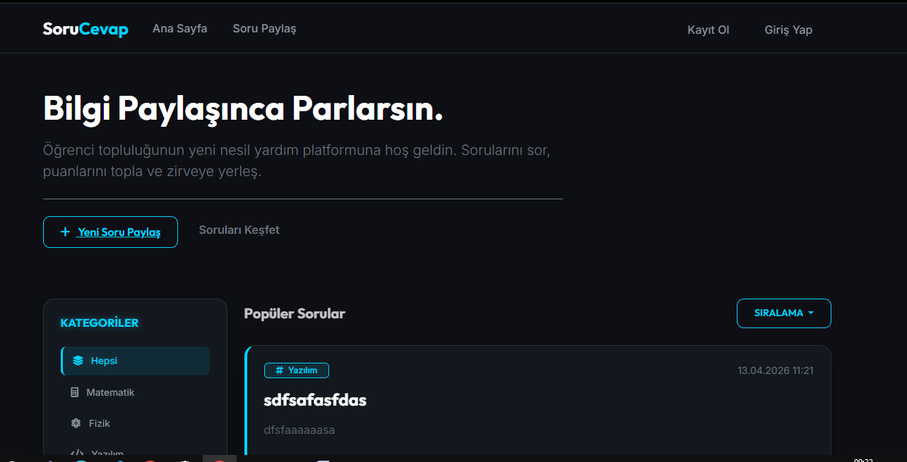
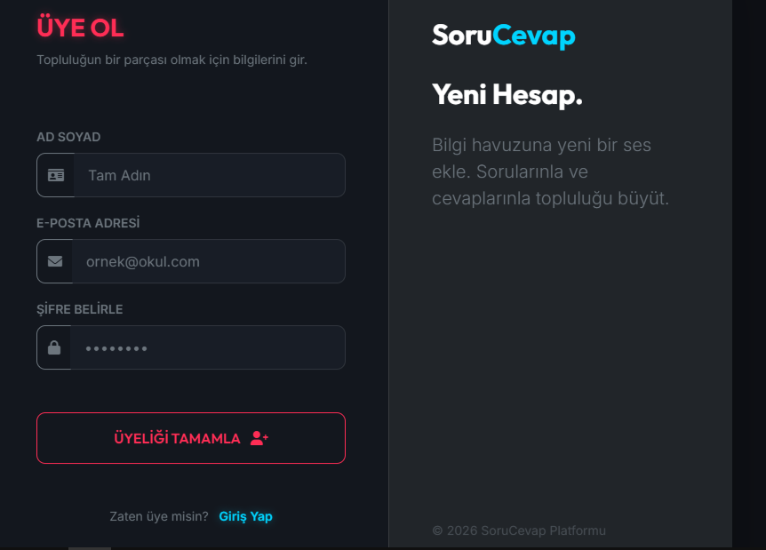

# 🌌 SoruCevap (Forum) - Elegant Neon Gamified Q&A Platform

[](https://dotnet.microsoft.com/en-us/download/dotnet/8.0)
[]()
[]()
[]()

SoruCevap, öğrenciler ve yazılım geliştiriciler için tasarlanmış, **oyunlaştırma (gamification)** mekanikleri barındıran ve göz alıcı bir **Elegant Neon** karanlık mod tasarımına sahip modern bir Soru-Cevap (Forum) uygulamasıdır. 

Kullanıcılar soru paylaşıp yanıt alırken puan kazanır, rütbe atlar ve toplulukta öne çıkar. Yöneticiler (Admin) ise gelişmiş istatistikler, raporlama araçları ve detaylı kullanıcı yönetimi yetkileri ile tüm sistemi kontrol edebilir.

---

## 📸 Ekran Görüntüleri (Screenshots)

> [!NOTE]
> Projeyi GitHub portföyünüzde sergilemek için uygulamanın ekran görüntülerini alıp `/docs/screenshots/` klasörü altına eklemeniz ve buradaki linkleri güncellemeniz önerilir.

| Ana Sayfa (Feed) | Soru Detayları & Cevaplar |
| :---: | :---: |
|  |  |

| Yönetici Paneli (Command Center) | Giriş & Kayıt Sayfaları |
| :---: | :---: |
|  |  |

---

## ✨ Öne Çıkan Özellikler (Core Features)

### 🎨 1. Elegant Neon Arayüzü & Tasarım
- **Modern Karanlık Mod:** Mat gece mavisi/koyu gri (`#0d0f14`) tonlarında göz yormayan arayüz.
- **Neon Vurgular:** İnce kenarlıklarda, butonlarda ve hover durumlarında kullanılan parlayan Cyan (`#00d4ff`) ve Pink (`#ff2d55`) neon çizgileri.
- **Tipografi:** Profesyonel ve okunabilirliği yüksek `Outfit` ve `Inter` yazı tipleri.
- **Responsive Tasarım:** Mobil, tablet ve masaüstü cihazlar için tam uyumlu Bootstrap 5 tabanlı grid yapı.

### 🎮 2. Oyunlaştırma (Gamification) & Rütbeler
- **XP / Puan Kazanma:**
  - Soruya cevap yazma: **+10 XP**
  - Cevabın beğeni (like) alması: **+5 XP**
- **Dinamik Rütbe Sistemi:** Kullanıcıların puanlarına göre otomatik atanan rütbeler:
  - `Acemi` (0 - 99 XP)
  - `Bilgin` (100 - 499 XP)
  - `Üstat` (500+ XP)
- **Kullanıcı Rozetleri:** Belirli puan sınırlarına ulaşıldığında profilde otomatik açılan görsel başarı rozetleri.

### 🛡️ 3. Gelişmiş Admin Yönetim Paneli (Command Center)
- **Metrik Analizleri:** Toplam kullanıcı, soru ve cevap sayıları.
- **Kullanıcı Kontrolü:** Kullanıcıları askıya alma (banlama) veya rollerini (Öğrenci/Yönetici) tek tıkla değiştirme.
- **Güvenlik Filtresi:** Askıya alınan kullanıcıların sisteme girişi otomatik olarak engellenir.
- **Veri Dağılım Grafikleri:** Kategori bazlı soru sayılarını gösteren dinamik **Chart.js** grafik entegrasyonu.

### 📊 4. Excel & PDF Raporlama
- **Excel Çıktısı (ClosedXML):** Tüm soru ve kullanıcı listesini puan/statü bilgileriyle birlikte Excel (.xlsx) olarak indirme.
- **PDF Raporu (QuestPDF):** Sistemdeki soruların ve istatistiklerin şık bir tablo tasarımıyla PDF formatında indirilmesi.

---

## 🛠️ Teknoloji Yığını (Tech Stack)

- **Backend:** ASP.NET Core 8.0 MVC
- **Database / ORM:** MS SQL Server & Entity Framework Core (Code-First)
- **Security / Auth:** Microsoft ASP.NET Core Identity
- **Frontend:** HTML5, CSS3 (Vanilla CSS variables), JavaScript (jQuery, AJAX)
- **Library & Plugins:**
  - [Bootstrap 5](https://getbootstrap.com/) - Responsive Layout
  - [Chart.js](https://www.chartjs.org/) - İstatistik Grafikleri
  - [ClosedXML](https://github.com/ClosedXML/ClosedXML) - Excel Export
  - [QuestPDF](https://www.questpdf.com/) - PDF Raporlama
  - [FontAwesome](https://fontawesome.com/) - Modern İkon Setleri

---

## 🚀 Kurulum ve Çalıştırma (Setup & Run)

### Gereksinimler
- [.NET 8.0 SDK](https://dotnet.microsoft.com/en-us/download/dotnet/8.0)
- [MS SQL Server](https://www.microsoft.com/en-us/sql-server/sql-server-downloads) (veya LocalDB)
- Visual Studio 2022 veya VS Code

### Adım Adım Kurulum

1. **Projeyi Klonlayın veya İndirin:**
   ```bash
   git clone https://github.com/kullanici-adiniz/SoruCevap-Forum.git
   cd SoruCevap-Forum
   ```

2. **Veritabanı Bağlantısını Yapılandırın:**
   `appsettings.json` dosyasındaki `DefaultConnection` bağlantı adresini kendi SQL Server ayarlarınıza göre güncelleyin:
   ```json
   "ConnectionStrings": {
     "DefaultConnection": "Server=YOUR_SQL_SERVER;Database=SoruCevapDb;Trusted_Connection=True;MultipleActiveResultSets=true;TrustServerCertificate=True"
   }
   ```

3. **Veritabanı Tablolarını Oluşturun (Migrations):**
   Terminal veya Package Manager Console üzerinden migration'ları uygulayın:
   ```bash
   dotnet ef database update
   ```

4. **Projeyi Başlatın:**
   ```bash
   dotnet run
   ```
   Uygulama varsayılan olarak `http://localhost:5000` veya `https://localhost:5001` adresinde çalışacaktır.

---

## 🔑 Varsayılan Yönetici Bilgileri (Default Admin Credentials)

Sistemi test etmek ve Admin Paneline erişmek için aşağıdaki hazır hesabı kullanabilirsiniz:
- **E-posta:** `admin@forum.com`
- **Şifre:** `Admin123!`

---

## 📂 Proje Klasör Yapısı (Project Structure)

```text
SoruCevap(forum)/
│
├── Controllers/          # MVC Controller dosyaları (Admin, Account, Questions, Answers)
├── Data/                 # ApplicationDbContext ve veritabanı tohum verileri (Seeds)
├── Migrations/           # EF Core Migration dosyaları
├── Models/               # Veri modelleri ve DTO'lar (ApplicationUser, ForumModels)
├── Views/                # Razor View (.cshtml) dosyaları
│   ├── Home/             # Ana sayfa görünümü
│   ├── Admin/            # Yönetici paneli ve grafikler
│   ├── Account/          # Giriş ve kayıt ekranları
│   └── Shared/           # Ortak kullanılan layout ve bileşenler
├── wwwroot/              # Statik dosyalar (CSS, JS, Görseller)
│   ├── css/              # Elegant Neon stil dosyamız (site.css)
│   └── js/               # AJAX, like ve dinamik işlemleri içeren scriptler
├── docs/                 # Portföy belgeleri ve ekran görüntüleri
└── README.md             # Proje genel tanıtım dosyası
```

---

## 📄 Lisans (License)
Bu proje **MIT Lisansı** altında lisanslanmıştır. Daha fazla bilgi için `LICENSE` dosyasına göz atabilirsiniz.
